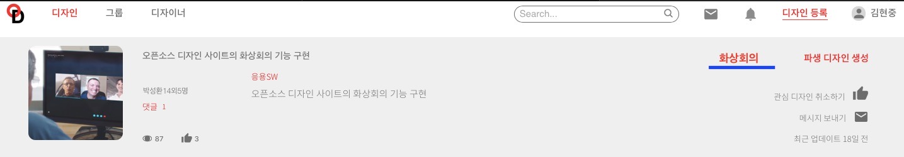
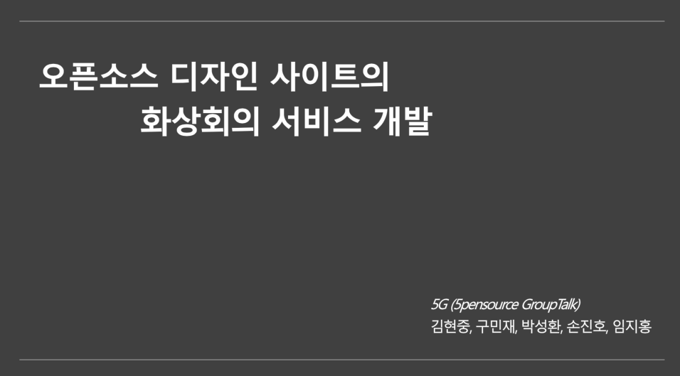
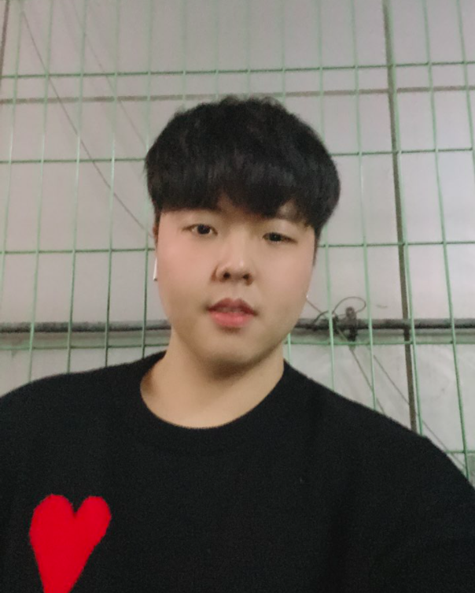
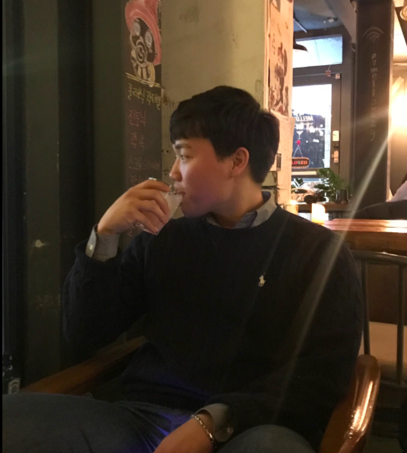
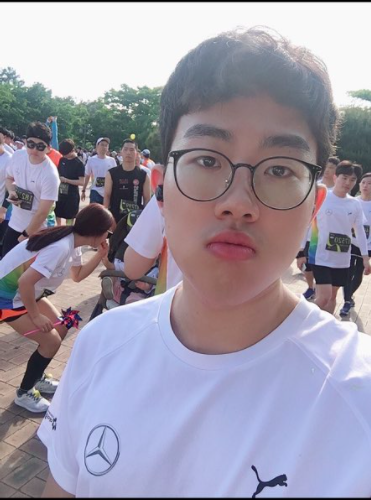
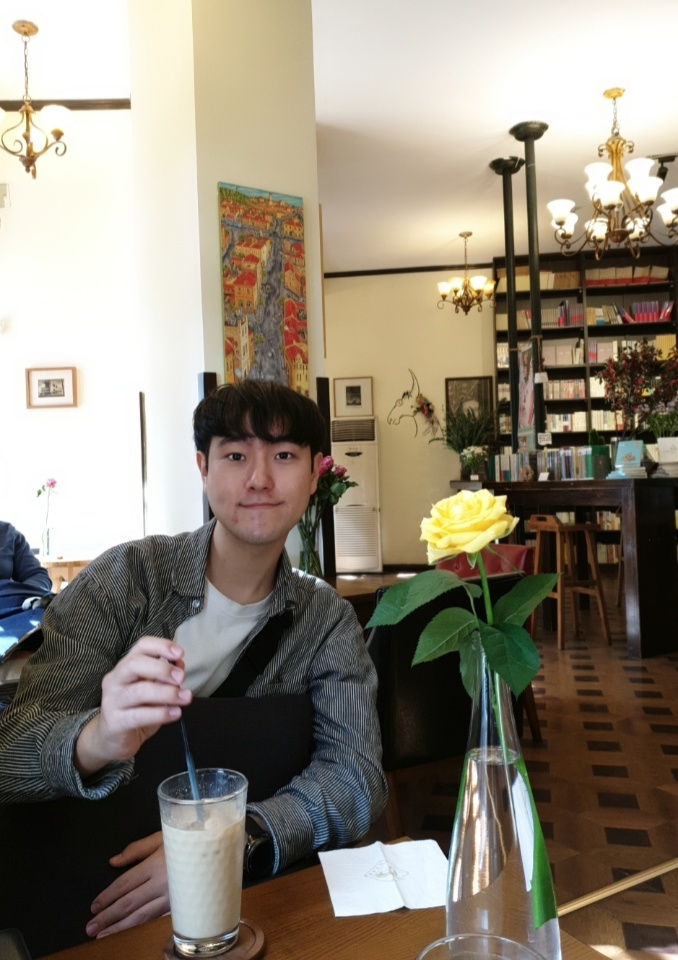

# 5G (5pensource GroupTalk)
  

## 1. 프로젝트 소개 
**오픈소스 디자인 사이트(OSD)의 다국적 화상회의 서비스 개발**


  팀 프로젝트 개발과정에 있어 협업이 필요한 가운데 시간의 제약, 공간의 제약이 없는 플랫폼에 대한 수요가 높아지고 있다.
  
  
  Skype,Zoom 등 수많은 화상회의 프로그램이 개발되어 있으나 코드의 관리 등 프로젝트의 전반적 개발과정은 다른 프로그램을 이용하기 때문에 화상회의를 하는데 있어
  효율성이 떨어진다.
  
  
  현재 운영되고 있는 오픈소스디자인 사이트(https://opensrcdesign.com)
  는 프로젝트 진행 과정에 있어 단순 코드 공유뿐만이 아닌
  기획서, UI설계서, 회의록 등등 프로젝트 전반적인 개발과정을 팀원들과 공유할수 있는 사이트이다.
  이러한 사이트에 화상회의 서비스를 개발하여 번거롭게 다른 프로그램을 이용하지 않고 효과적인 팀 프로젝트를 진행할수 있도록 하고자 한다.
  
  
  
  추가적으로, 화상회의를 하는데 있어 서로 다른 국적을 가진 경우 언어의 제약이 존재한다.<br>
  상대방이 말할 때 자신의 언어로 번역하여 상대방이 어떤 말을 하였는지 확인할 수 있는 기능을 추가하여
  **다국적 협업**이 가능할 수 있는 화상회의 서비스를 개발하고자 한다.


## 2. Abstract
  In the process of team project development, there is a growing demand for platforms that do not have time limitations or         
  space limitations while requiring collaboration.
  
  A number of video conferencing programs such as Skype and Zoom have been developed, but the overall development process of the project, such as code management, uses a different program.The efficiency is poor.
  
  
   Open source design site currently in operation (https://opensrcdesign.com) is not only a simple code sharing process. It is a site that can share the overall development process of the project, such as proposals, UI designs, meeting minutes, etc. with team members.
   
   
  We would like to develop a video conferencing service on these sites so that effective team projects can be conducted without the hassle of using other programs.   
   
   Additionally, there are language restrictions for video conferencing with different nationalities. When the other person speaks, you can translate it into your own language and add a function to check what the other person has said. We intend to develop a video conferencing service that may enable **multinational collaboration**.
   
   


## 3. 소개 영상

   - 수행 계획  영상 
   
   [](https://www.youtube.com/watch?v=43OHHyTTemA)


## 4. 팀 소개

### Professor
- 한광수 교수님 

### 팀원

- 김현중(팀장)
 

 
 ```
 * 학번: 20153167
 * 역할: 화상회의 시스템 구축(webRTC) 및 UI 개발, OSD 연동
 * E-mail: a1a1a1@kookmin.ac.kr
 ```
 
- 손진호 
 

 
  ```
 * 학번: 20141763 
 * 역할: 번역서버 개발(Speech to Text 환경), OSD 연동 
 * E-mail: fkakdzk2@kookmin.ac.kr 
 ```

- 박성환 
 

 
  ```
 * 학번: 20141757
 * 역할: 화상회의 시스템 구축(webRTC) 및 UI 개발, OSD 연동 
 * E-mail: 20141757@kookmin.ac.kr
 ```
 
- 구민재  
 

 
  ```
 * 학번: 20153150
 * 역할: 번역서버 개발(Translate 환경), OSD 연동 
 * E-mail: mjn9ine@gmail.com
 ```
 
 - 임지홍  
 

 
  ```
 * 학번: 20153220 
 * 역할: 채팅서버 개발(MongoDB), OSD 연동
 * E-mail: jhlim2323@kookmin.ac.kr 
 ```
 
 


